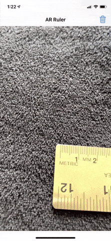

# AR-Measurement-App
This augmented reality iOS app will allow users to measure items.

## Features:
- Users can use this app to measure items.
- Mark the start position by tapping the screen
- Mark the end position by tapping the screen
- The measurement will be displayed above in centimeters (cm)
- To erase measurement, tap the 🗑 (dustbin) button

## Demo:

## Technology Used:
- Swift
- AR Kit
- Scene Kit
- UI Kit

## Notes:
